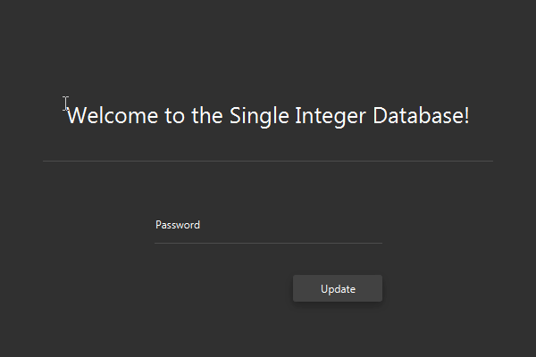

# DatabaseGUI

### Description
This program demonstrates a simple Table View element in JavaFX, populated with values pulled from a remote MySQL database. This program use of the [JFoenix](https://github.com/jfoenixadmin/JFoenix) library's custom containers. One must have the appropriate database password in order to access the program's full functionality.

### Table of Contents
- [Demonstration](#demonstration)
- [Installation](#installation)
- [Usage](#usage)
- [Contributing](#contributing)
- [License](#license)

### Demonstration

### Installation 
While the documents contained in this project are able to be implemented in any Java IDE, it is most simple to clone this repository on the IntelliJ IDE, the IDE that I used to develop this application. To run this program, the user simply needs to run the driver method in the "Main" class. The dependencies for this program are stored in the lib folder; although these will likely be linked to the program upon cloning, one may add them to the dependencies list of your IDE of choice manually.

### Usage
To be able to access the database that this program utilizes, one would have to have the specific password required by the database that I'm using. For security reasons, I am not opening this password up for use by others, however the [demonstration](#demonstration) outlines the operations that this program is capable of.

### Contributing 
The best way to go about contributing to this project would be by forking this repository, cloning it in your IDE of choice (I would recommend working with this repo on IntelliJ), committing/pushing your changes to your fork, and making a pull request that describes your contribution(s).

### License
This project implements the MIT license.
